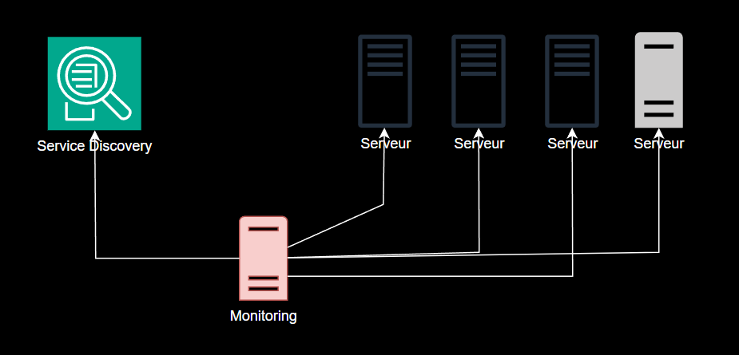

# Prometeus et Grafana

## Contexte

- Monitoring et Alerting classique non adapté à une infra cloud
- Agrégation de statistique plus adaptées
- Alerting sur indisponibilité au lieux de métriques spécifiques (Fatigue des alertes)

## Pourquoi grafana et prometeus ? 

- pull (vs push)
- cloud native (service discovery)
- tsdb (scale mieux vs sql)
- Agrégation de métriques
- Même language pour query, graphe et alertes (promQL)

Plus adapté pour les infra dynamique/cloud native

## Comment ca marche ?

- Les app / serveurs exposent des metriques en http sur /metrics (valeur à instant T)
- Prometheus peut découvrir les target (cibles) à scrapper
- Prometheus les récupère et les met dans sa base de données
- On peut faire des requêtes (promql) pour faire des graphes de ces données (via UI, api or grafana par ex)
- On peut mettre en place des alertes quand ces métriques dépassent un seuil (alert manager)

