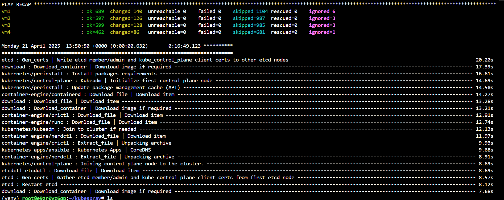

## Test en local de Kubespray

J'ai voulu tester la mise en production de mon cluster Kubernetes avec kubespray avant d'automatiser la chose avec Terraform.
Pour ce faire, je me suis rendu sur un environnement bac à sable où je peux créer des vm en ligne. 

J'ai commencer à créer 5 machine, 4 pour mon cluster et 1 pour celle à partir que je vais faire mon déploiement. 

Ensuite, j'ai cloner kubespray et installer les dépendances: 

git clone https://github.com/kubernetes-sigs/kubespray.git
cd kubespray
sudo pip install -r requirements.txt

- Si l'on veut installer pip: 

sudo apt update
sudo apt install python3-pip -y

- Si on a l'erreur de la protéction système on va utiliser un environnement virtuel. 

python3 -m venv venv
source venv/bin/activate

- Si l'on a pas le module venv :
 
sudo apt update
sudo apt install python3.12-venv -y

- Et on re essaye d'installer les paquets:
 
pip install -r requirements.txt

Si l'on veut quitter l'environnement virtuel : deactivate

Ensuite, on vient créer le fichier inventory.ini: cp -rfp inventory/sample inventory/mycluster
et on modifie ensuite le fichier host.yaml :

    all:
      hosts:
         vm1:
          ansible_host: 10.141.17.252
          ip: 10.141.17.252
          access_ip: 10.141.17.252
         vm2:
          ansible_host: 10.141.17.219
          ip: 10.141.17.219
          access_ip: 10.141.17.219
         vm3:
          ansible_host: 10.141.17.145
          ip: 10.141.17.145
          access_ip: 10.141.17.145
         vm4:
          ansible_host: 10.141.17.195
          ip: 10.141.17.195
          access_ip: 10.141.17.195

      children:
         kube_control_plane:
          hosts:
            vm1:
            vm2:
            vm3:
         kube_node:
          hosts:
            vm1:
            vm2:
            vm3:
            vm4:
         etcd:
          hosts:
           vm1:
           vm2:
           vm3:
         k8s_cluster:
          children:
           kube_control_plane:
           kube_node:
         calico_rr:
          hosts: {}

On vient s'assurer qu'on puisse se connecter en ssh aux machines. 
Puis on lance la commande: ansible-playbook -i inventory/mycluster/hosts.yaml cluster.yml -b -v

Ce qu'on obtiens après
- Un cluster Kubernetes complet avec 3 masters + 1 worker

- Calico comme réseau CNI

- Configuration compatible avec ArgoCD, GitLab CI/CD, Prometheus, etc.

- Un kubectl opérationnel (Kubeconfig généré dans ~/.kube/config si on actives le copy) 

L'installation est assez longue, cela m'a pris 10~15 min. 

Le résultat: 

## Alias pour kubernetes

On peut décider d'ajouter des alias pour nous faciliter la vie. Exemple: kubectl = k

- Pour ce faire, on vient cloner le dépot git: git clone https://github.com/ahmetb/kubectl-aliases.git

- Executer le script dedans: python3 generate_aliases.py > ~/kubectl-aliases/alias.sh

- Ajouter le fichier alias.sh au fichier .bashrc: echo 'source ~/kubectl-aliases/alias.sh' >> ~/.bashrc

- Recharger le fichier de conf: source ~/.bashrc

